# InkFlow — End-to-End User Journeys

> A complete walkthrough of every key workflow in InkFlow, including process flow diagrams for demos, customer walkthroughs, and manual testing reference.

---

## Table of Contents

1. [Studio Onboarding](#1-studio-onboarding)
2. [Studio Configuration](#2-studio-configuration)
3. [Artist Setup](#3-artist-setup)
4. [Appointment Types & Public Booking Setup](#4-appointment-types--public-booking-setup)
5. [Creating an Appointment (Internal)](#5-creating-an-appointment-internal)
6. [Customer Self-Booking (Public Portal)](#6-customer-self-booking-public-portal)
7. [Deposit Collection](#7-deposit-collection)
8. [Appointment Checkout](#8-appointment-checkout)
9. [Daily Settlement](#9-daily-settlement)
10. [Availability Management](#10-availability-management)
11. [Reporting Categories & Products](#11-reporting-categories--products)
12. [User & Role Management](#12-user--role-management)
13. [Reports & Analytics](#13-reports--analytics)

---

## 1. Studio Onboarding

**Who:** New studio owner signing up for InkFlow for the first time.

**Goal:** Create an account, confirm email, and complete studio onboarding so the full application is unlocked.

### Steps

1. Navigate to the application URL and click **Sign Up**.
2. Enter full name, email address, and a password (minimum 6 characters).
3. Submit the form — Supabase sends a confirmation email.
4. Click the confirmation link in the email. The link redirects to the **Onboarding** page.
5. Choose the studio setup path: **Create a new studio** or **Join an existing studio** (via invite code).
6. For a new studio: enter studio name and submit.
7. The system provisions a `studios` record, sets `is_onboarded = true` on the user, and redirects to the **Dashboard**.

> After onboarding, the studio starts in an **active** state for the owner account. Front Desk and Artist users see a **Pending Validation** screen until an Admin activates their account.

### Flow Diagram

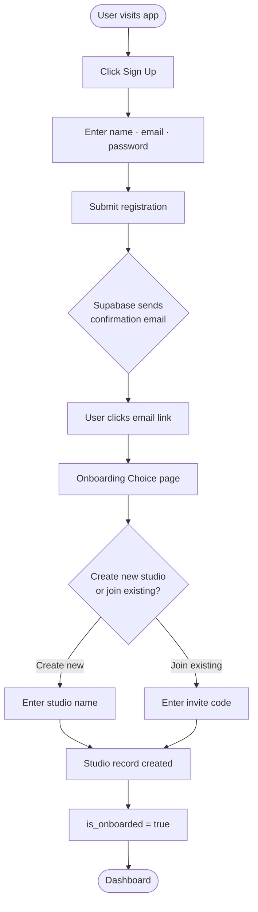

---

## 2. Studio Configuration

**Who:** Studio Owner or Admin.

**Goal:** Set up the foundational data — locations, workstations, and studio-wide settings — before any bookings can be taken.

### 2a. Locations

1. Navigate to **Locations** in the sidebar.
2. Click **Add Location**.
3. Fill in: Name, Address, City, State, Phone, Email, and Timezone.
4. Click **Save**. The location now appears in all booking dropdowns.
5. Repeat for each physical studio location.

### 2b. Workstations

1. Navigate to **Workstations**.
2. Click **Add Workstation**.
3. Assign a name (e.g. "Chair 1") and select the location it belongs to.
4. Set status to **Active**.
5. Click **Save**. The workstation is now checked for double-booking during appointment creation.

### 2c. Studio Settings

1. Navigate to **Studio Settings**.
2. Connect Stripe: click **Connect with Stripe** and complete the Stripe OAuth flow. Once connected, `stripe_charges_enabled = true` and deposit/checkout payment links become available.
3. Optionally configure tax rate, booking confirmation message, and branding.

### Flow Diagram

```mermaid
flowchart LR
    A([Admin logs in]) --> B[Locations]
    B --> B1[Add Location\nname · address · timezone]
    B1 --> B2[Save → Location active]
    B2 --> C[Workstations]
    C --> C1[Add Workstation\nname · location]
    C1 --> C2[Save → Workstation active]
    C2 --> D[Studio Settings]
    D --> D1[Connect Stripe OAuth]
    D1 --> D2[stripe_charges_enabled = true]
    D2 --> E([Studio fully configured])
```

---

## 3. Artist Setup

**Who:** Studio Admin or Owner.

**Goal:** Register artists on the platform, assign their type, configure their split rule, and set their recurring weekly schedule.

### 3a. Creating an Artist Profile

1. Navigate to **Artists** in the sidebar.
2. Click **Add Artist**.
3. Select a **User** from the dropdown (must be a user with Artist, Admin, or Owner role who has already joined the studio).
4. Confirm or edit the **Full Name** (auto-populated from the selected user).
5. Select **Artist Type**: Tattoo Artist, Piercer, or Both.
   - This controls visibility in the public booking portal (piercers only appear for piercing services).
6. Fill in optional fields: Specialty, Instagram handle, Phone, Bio, Hourly Rate.
7. Select **Primary Location**.
8. Ensure **Active Status** is toggled on.
9. Click **Create**. The artist card appears in the grid.

### 3b. Configuring Revenue Split

1. On the **Artists** page, locate the artist card.
2. Click the **Set Split** button (or the percentage label if a rule exists).
3. In the Revenue Split dialog:
   - Set **Artist Split %** (e.g. 60 means the artist earns 60%, shop earns 40%).
   - Optionally check **Eligible Categories** — only revenue in those reporting categories counts toward this split.
4. Click **Save Split Rule**.
5. The button on the artist card updates to show the configured percentage (e.g. "60%").

### 3c. Setting a Weekly Schedule

1. Navigate to **Availability** in the sidebar (or **My Availability** for the artist's own view).
2. Admins can switch between artists using the **Artist** dropdown at the top.
3. In the **Weekly Schedule** section, click **Add Day**.
4. Select the **Day of week** (e.g. Monday), **Start time**, **End time**, and optionally a specific **Location**.
5. Click **Save**. The schedule chip appears in the list and that day's slots appear on the calendar.
6. Repeat for each working day.
7. Use the calendar below to add **one-off availability** (click the `+` on any calendar date) or **block time** (mark as "blocked" in the Availability Dialog) for vacations and breaks.

### Flow Diagram

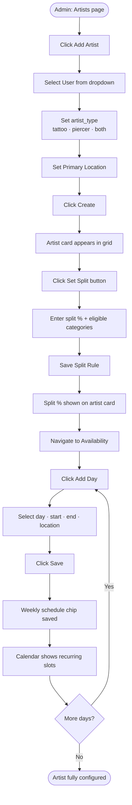

---

## 4. Appointment Types & Public Booking Setup

**Who:** Studio Admin or Owner.

**Goal:** Define the types of appointments offered (e.g. Tattoo Consultation, Piercing), configure pricing and deposits, and optionally enable public online booking for each type.

### Steps

1. Navigate to **Appointment Types**.
2. Click **Add** / **New Appointment Type**.
3. Fill in:
   - **Name** (e.g. "Ear Piercing")
   - **Category** (Tattoo or Piercing)
   - **Default Duration** (hours)
   - **Default Deposit** ($)
   - **Description** (shown on the public booking page)
4. Toggle **Allow Online Booking** on — this sets `is_public_bookable = true` and makes the type visible in the public portal.
5. Optionally link a **Reporting Category** for revenue tracking.
6. Click **Save**.

> **Sharing the booking link:** Navigate to **Studio Settings** to copy your public booking URL: `https://yourapp.com/book?studio=YOUR_STUDIO_ID`. Share this link on your website or social media.

### Flow Diagram

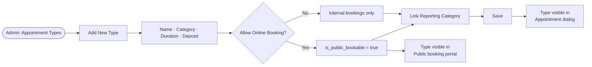

---

## 5. Creating an Appointment (Internal)

**Who:** Front Desk Staff, Artist (own appointments), or Admin.

**Goal:** Book an appointment for a client from within the studio management app.

### Steps

1. Navigate to **Appointments** or **Dashboard**.
2. Click **New Appointment**.
3. In the Appointment Dialog:
   - Select **Location** (required).
   - Select **Artist** (required). The system checks for conflicts with existing appointments and shows a warning if the artist is double-booked.
   - Select **Appointment Type** (optional — set to "No Type" if ad hoc).
   - Set **Date** and **Start Time**.
   - Set **Duration** (hours).
   - If workstations are configured, select a **Work Station**. The system blocks the save button if no stations are free at the chosen time.
   - Search for an existing **Customer** or type a new **Client Name**, **Email**, and **Phone**.
   - Set **Deposit Amount** (if collecting a deposit).
   - Set **Total Estimate**.
   - Add **Design Description**, **Placement**, and **Notes** as needed.
4. Click **Create**. The appointment appears on the calendar and in the appointments list.

> **Conflict detection:** If the selected artist already has an appointment overlapping the chosen time, a red warning banner appears and the Create button is disabled until the conflict is resolved.

### Flow Diagram

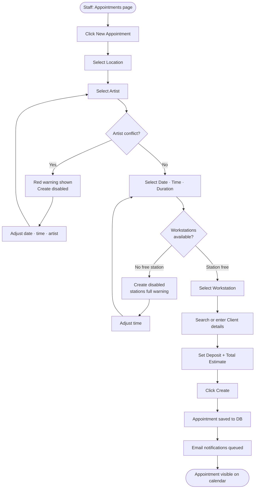

---

## 6. Customer Self-Booking (Public Portal)

**Who:** End customer (unauthenticated).

**Goal:** A client books their own appointment online via the studio's public booking link, without needing to call or visit.

**Prerequisites:**
- At least one appointment type with `is_public_bookable = true`
- Artist with matching type (e.g. `piercer` or `both` for piercing services) with a weekly schedule or availability set

### Steps

1. Client opens the studio's public booking URL: `/book?studio=STUDIO_ID`
2. **Step 1 — Select Service:** Client sees all public-bookable appointment types with duration and deposit shown. They click the desired service.
3. **Step 2 — Choose Artist & Location:**
   - Select a **Location** from the dropdown.
   - Select a **Piercer** (or "Any Available Piercer") — filtered to artists with `artist_type = piercer` or `both`.
   - Click **Continue**.
4. **Step 3 — Select Date & Time:**
   - Pick a **Date** (tomorrow or later).
   - The system computes available time slots by:
     - Loading the artist's weekly schedules + one-off availabilities
     - Removing blocked periods
     - Removing times already booked by existing appointments
     - Removing times where all workstations at the location are occupied
   - Client selects an available slot.
   - Click **Continue**.
5. **Step 4 — Your Details:**
   - Enter **Name**, **Email**, and **Phone** (all required).
   - Click **Confirm Booking**.
6. The `create-public-booking` Supabase Edge Function runs:
   - Creates or finds a Customer record.
   - Creates an Appointment record with `status = scheduled`.
   - If the appointment type has a deposit > $0, creates a Stripe Checkout session and returns the checkout URL.
7. **Booking Confirmed!** screen appears. If a deposit is required, a **Pay Deposit** button links to Stripe.

### Flow Diagram

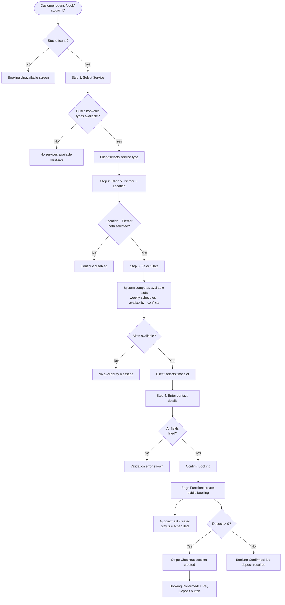

---

## 7. Deposit Collection

**Who:** Front Desk Staff or Admin (creating the deposit link); Client (paying it).

**Goal:** Collect a deposit from a client before their appointment via a Stripe-hosted checkout link.

### Steps

1. Open an appointment by clicking it on the **Appointments** page or **Calendar**.
2. In the Appointment Dialog, verify **Deposit Amount > $0** is set.
3. Click **Create Deposit Link**.
   - The `create-deposit-checkout` Supabase Edge Function fires, creating a Stripe Checkout session.
   - A read-only URL input appears with the deposit link and a **Copy** button.
4. Copy the link and send it to the client (email, SMS, or messaging app).
5. Client opens the link → Stripe-hosted checkout page → enters card details → pays.
6. Stripe webhook updates `deposit_status = 'paid'` on the appointment.
7. Back in the app, the appointment dialog shows the deposit as **Paid** and the **Create Deposit Link** button is hidden.

> If a deposit link needs to be resent (e.g. the client lost the email), click **Resend Deposit Link** — a new Stripe Checkout session is created.

> **Cancelled payment:** If the client abandons checkout, they are redirected to `/deposit-cancelled`. The appointment's deposit status remains unpaid. Staff can resend the link at any time.

### Flow Diagram

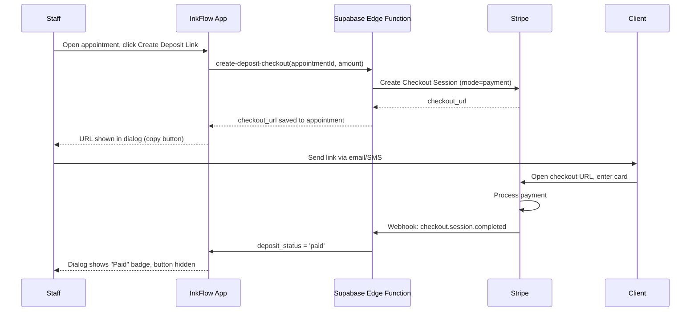

---

## 8. Appointment Checkout

**Who:** Front Desk Staff or Admin.

**Goal:** Mark an appointment as completed and record the final payment — either manually (cash/card in person) or via a new Stripe payment link.

### Steps

1. Open the appointment from **Appointments** or **Calendar**.
2. Click **Check Out** (visible for non-completed appointments to Front Desk and Admin).
3. The **Check Out Appointment** dialog opens:
   - **Charge Amount** pre-fills from `total_estimate`.
   - **Tax Amount** field for recording tax collected.
   - **Discount Amount** (appointment-level discount).
   - **Payment Method** dropdown: Cash, Card, Bank Transfer, Comp, etc.
   - **Add Line Items** (optional): add individual products or service charges from your inventory, each linked to a Reporting Category.
4. **Option A — Manual Checkout:**
   - Select payment method and click **Manual Checkout**.
   - Appointment `status` is set to `completed`. `charge_amount` and `payment_method` are recorded.
   - `appointment_charges` records are written for any line items added.
5. **Option B — Stripe Checkout:**
   - Enter **Charge Amount** (must be > $0).
   - Click **Check Out via Stripe**.
   - `create-checkout-payment` Edge Function creates a Stripe Checkout session.
   - A **payment link** appears. Open it or send it to the client.
   - Client pays on Stripe → webhook fires → appointment marked `completed`.
6. A completed appointment shows a green **Completed** badge and the checkout button is replaced with **Unlock** (Admin only, to reopen if correction needed).

### Flow Diagram

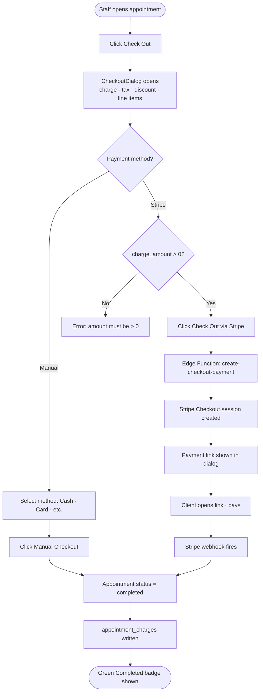

---

## 9. Daily Settlement

**Who:** Studio Admin or Owner.

**Goal:** At end of day, freeze all revenue from completed appointments into a locked payout record, showing gross, tax, discounts, net, POS vs online collected, and per-artist splits.

### Steps

1. Navigate to **Settlements** in the sidebar.
2. Select the **Settlement Date** (defaults to today).
3. Optionally filter by **Location** (or leave as "All Locations" to settle all at once).
4. Click **Generate Settlement**.
5. The system:
   - Finds all `completed` appointments for the selected date and location(s).
   - Aggregates `charge_amount`, `appointment_charges` line totals, `deposit_amount`.
   - Calculates: `gross_total`, `tax_total`, `discount_total`, `net_total`.
   - Splits POS vs online collections based on `payment_method`.
   - For each appointment, looks up the artist's active `artist_split_rule` and calculates `artist_share` and `shop_share`.
   - Writes one `daily_settlements` record (status = `locked`) and one `daily_settlement_lines` record per appointment.
6. The Settlement History table updates with the new locked record showing all financial columns.
7. The **Generate Settlement** button becomes **Already Settled** (disabled) for that date — settlements are immutable once locked.

> **Note:** Settlements with no completed appointments for the selected date create no record (the generation is skipped silently).

### Flow Diagram

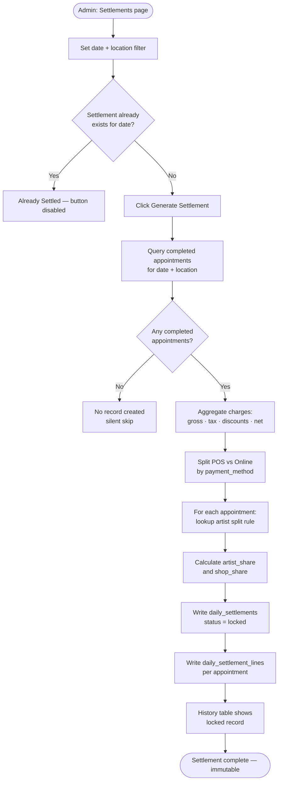

---

## 10. Availability Management

**Who:** Artist (own schedule), Admin (any artist).

**Goal:** Configure an artist's working hours so the booking system knows when slots are available.

InkFlow uses **two layers** of availability:

| Layer | Purpose | Where set |
|---|---|---|
| Weekly Schedule | Recurring work hours (Mon 9–5, Wed 10–6, etc.) | Availability page → Weekly Schedule section |
| One-off Availability | Specific date/range overrides (vacation, guest spots) | Availability page → Calendar `+` button |

### Steps — Weekly Schedule

1. Navigate to **Availability**.
2. Admin: use the artist picker to select the correct artist.
3. In the **Weekly Schedule** card, click **Add Day**.
4. Select **Day of week**, **Start time**, **End time**, and optionally a **Location**.
5. Click **Save**. The chip appears and that day's slots are visible on the calendar (indigo, labelled "weekly").
6. Hover a chip and click the edit icon to change times. Click the trash icon to remove it.

### Steps — One-off Availability / Blocked Time

1. On the calendar, click the `+` icon on any date in the current month.
2. In the **Availability Dialog**:
   - Set **Start Date** and **End Date** (for multi-day ranges like vacations).
   - Set **Start Time** and **End Time**.
   - Select **Location** (or leave blank for all).
   - Toggle **Is Blocked** on to mark the time as time-off (shown in red on the calendar).
3. Click **Save**.

### Flow Diagram

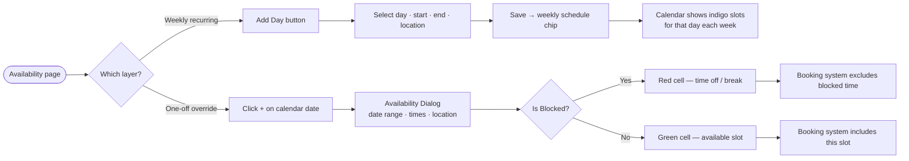

---

## 11. Reporting Categories & Products

**Who:** Studio Admin or Owner.

**Goal:** Define revenue categories used in settlements and reports, and manage the product/inventory catalog that can be added as line items at checkout.

### 11a. Reporting Categories

1. Navigate to **Reporting Categories**.
2. Click **Add Category**.
3. Fill in:
   - **Name** (e.g. "Tattoo Services", "Jewelry", "Gift Cards")
   - **Category Type**: Service, Item, or Store Credit — controls how it's grouped in reports
   - **Display Order** — controls the order categories appear in dropdowns
   - **Active** toggle
4. Click **Save**. The category is now available when creating products, appointment types, and artist split rules.

### 11b. Products / Inventory

1. Navigate to **Products**.
2. Click **Add Product** (or **Import CSV** for bulk upload).
3. Fill in:
   - **Product Name** (required)
   - **SKU** (optional barcode-scanner compatible identifier)
   - **Barcode** (optional, for handheld scanner use at checkout)
   - **Price** (sale price shown to customers)
   - **Cost** (your cost, for margin tracking)
   - **Reporting Category** (links to categories defined above)
   - **Active** toggle
4. Click **Save Product**.
5. At appointment checkout, staff can add products as line items — each charge is stored in `appointment_charges` with a snapshot of the category name.

### CSV Import Format

```
name,sku,barcode,price,cost,category_name
Tattoo Aftercare Lotion,TAL-001,012345678901,24.99,8.50,Retail Items
Healing Balm,HB-002,,12.99,3.00,Retail Items
```

### Flow Diagram

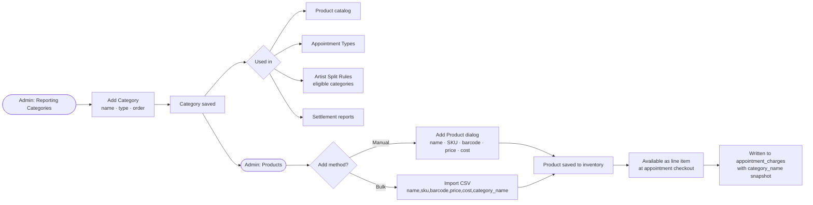

---

## 12. User & Role Management

**Who:** Studio Owner or Admin.

**Goal:** Invite new team members, assign them roles, and manage access.

### Roles

| Role | What they can do |
|---|---|
| **Owner** | Everything — all pages, settings, settlements, user management |
| **Admin** | Same as Owner except cannot manage billing |
| **Front Desk** | Create/edit appointments, customers, view calendar. No settings or settlements |
| **Artist** | View own appointments, set own availability. Limited to their data |

### Steps — Inviting a User

1. Navigate to **User Management**.
2. Click **Invite User**.
3. Enter the new user's email address and select their **Role**.
4. Click **Send Invite**. Supabase sends an invitation email.
5. The invited user clicks the link, sets their password, and completes sign-up.
6. They are automatically associated with your studio via `studio_id`.
7. Users with Artist, Admin, or Owner roles can then have artist profiles created for them on the **Artists** page.

### Flow Diagram

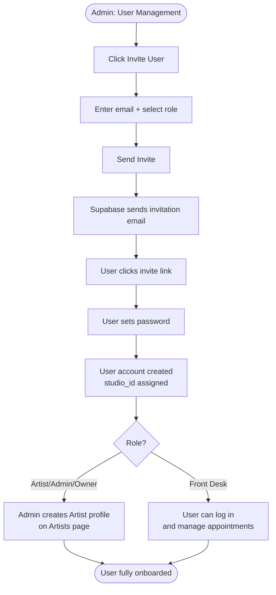

---

## 13. Reports & Analytics

**Who:** Studio Admin or Owner.

**Goal:** Review aggregated business performance across appointments, revenue, artists, and locations.

### Steps

1. Navigate to **Reports** in the sidebar.
2. Apply filters:
   - **Date range** (from/to)
   - **Location** filter
   - **Artist** filter
3. Review the key metric panels:
   - Total completed appointments
   - Total revenue (gross + net after tax/discounts)
   - Average appointment value
   - Deposits collected vs. outstanding
4. Scroll to the breakdown tables:
   - Revenue by **Reporting Category** (tattoo services, retail items, store credit)
   - Revenue and appointment counts by **Artist**
   - Revenue by **Location**
5. Cross-reference with **Settlements** for reconciliation — each daily settlement row ties back to the same date's completed appointments.

### Flow Diagram

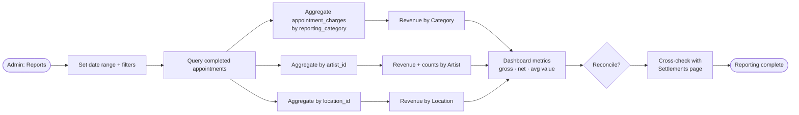

---

## End-to-End Demo Script

Use this sequence to walk a prospective customer through the full platform in approximately 20 minutes:

| Step | Page | What to show |
|---|---|---|
| 1 | Dashboard | Live stat cards, New Appointment button, quick overview |
| 2 | Artists | Artist grid with type badges, split % button, "Set Split" dialog |
| 3 | Availability | Weekly schedule chips, calendar with indigo recurring slots |
| 4 | Appointment Types | Public bookable toggle, deposit config |
| 5 | Public Booking | `/book?studio=ID` in new tab — 4-step wizard, time slot selection |
| 6 | Appointments | Created booking appears, deposit link button |
| 7 | Deposit Collection | Create deposit link → copy → show Stripe checkout in new tab |
| 8 | Checkout | Check Out dialog → Manual Checkout with cash → Completed badge |
| 9 | Settlements | Generate settlement for today → locked record with all financials |
| 10 | Reporting Categories | Show category types (service/item/store_credit) |
| 11 | Products | Product table, CSV import button |
| 12 | Reports | Revenue breakdown by category, artist, location |

---

*Generated for InkFlow — migrate3 (Commerce) + migrate4 (Artist Enhancements)*
